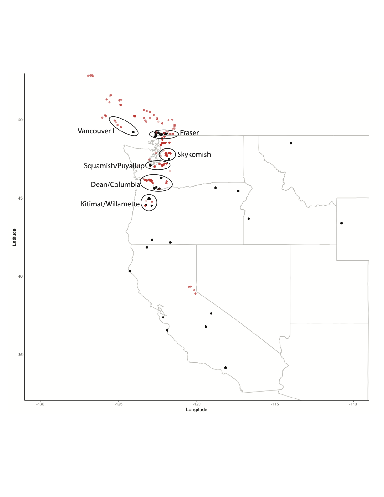

See [published version](https://rpubs.com/reamy316/npn_cottonwoods) of this document. 

### Read in packages and data

Read in necessary libraries. 

```{r, message=FALSE}
library(dplyr)
library(maps)
library(ggplot2)
library(kableExtra)
```

Read in black cottonwoods data extracted from NPN API, genetics data for black cottonwoods, and polygons for plotting US states and Canada. 

```{r}
cottonwood_npn <- read.csv("../data/raw_all_cottonwood.csv")

cottonwood_genetics <- read.csv("../data/Ptrichocarpa_genotypes_mapping.txt", 
                                sep = "\t")

base_map_usa <- map_data("state")
base_map_ca <- map_data("world", "Canada")
```

### Clean data

Clusters of data according to this map: 

{width=65%}

Getting NPN cottonwood individuals, combining with genetics data that have cultivar identifications, and sort into clusters. 
```{r}
cottonwood_npn_join <- cottonwood_npn %>% 
  group_by(individual_id) %>% 
  slice(1) %>% 
  ungroup() %>% 
  select(latitude, longitude) %>% 
  mutate(Cultivar = NA, 
         data_type = "NPN") %>% 
  rename(Lat = latitude, Long = longitude)

cottonwood_genetics_join <- cottonwood_genetics %>% 
  mutate(data_type = "genetics")

cottonwood_both <- bind_rows(cottonwood_npn_join, cottonwood_genetics_join) %>% 
  mutate(cluster = case_when((Lat > 44 & Lat < 45.1) ~ "Kitimat/Willamette", 
                             (Lat > 45.4 & Lat < 46.5 & Long < -120) ~ "Dean/Columbia", 
                             (Lat > 46.9 & Lat < 47.4 & Long > -123.5) ~ "Squamish/Puyallup",
                             (Lat > 47.4 & Lat < 48.2 & Long > -122.5) ~ "Skykomish",
                             (Lat > 48.7 & Lat < 49.3 & Long > -122.9) ~ "Fraser",
                             (Lat > 49 & Lat < 50 & Long > -125.5 & Long < -124) ~ "Vancouver I",
                             )) %>% 
         tidyr::unite(cluster_data_source, c(cluster, data_type), sep = " ", remove = FALSE)
```

### Dataset summaries

Counting number of NPN individuals in each cluster. 

```{r}
NPN_count <- cottonwood_both %>% 
  filter(!is.na(cluster), data_type == "NPN") %>% 
  count(cluster) %>% 
  arrange(desc(n))
kable(NPN_count, format = "markdown")
```

Saving csv with cultivars in each cluster. 

```{r}
genetics_count <- cottonwood_both %>% 
  filter(!is.na(cluster), data_type == "genetics") %>% 
  select(cluster, Cultivar) %>% 
  arrange(cluster)
write.csv(genetics_count, "cottonwood_cultivars.csv")
```

### Plot data

```{r}
ggplot() +
  geom_polygon(data = base_map_usa, aes(x = long, y = lat, group = group), 
               fill = "white", color = "grey") +
  geom_polygon(data = base_map_ca, aes(x = long, y = lat, group = group), 
               fill = "white", color = "grey") +
  geom_point(data = filter(cottonwood_both, !is.na(cluster)), 
             aes(x = Long, y = Lat, color = cluster, shape = data_type)) +
  coord_sf(xlim = c(-126, -121), ylim = c(44, 50)) +
  scale_shape_manual(values = c(1, 4)) +
  labs(x = "Longitude", y = "Latitude") +
  theme_classic()
```

