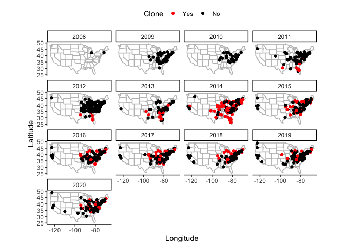
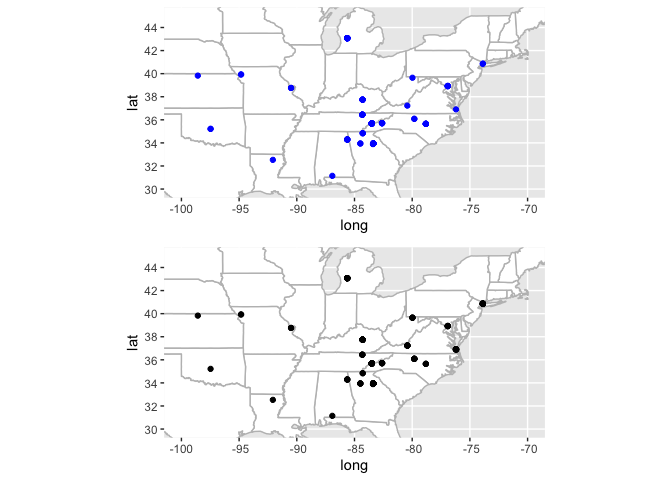
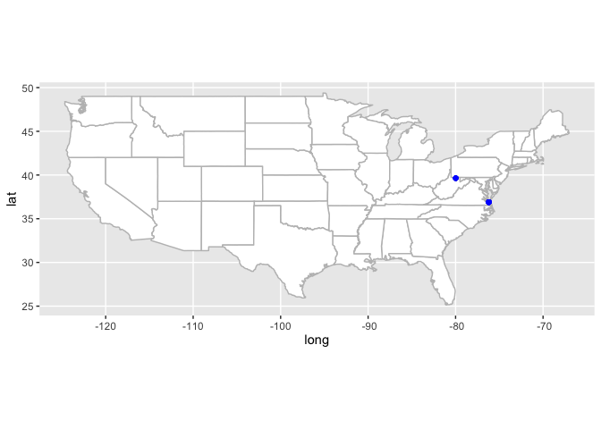
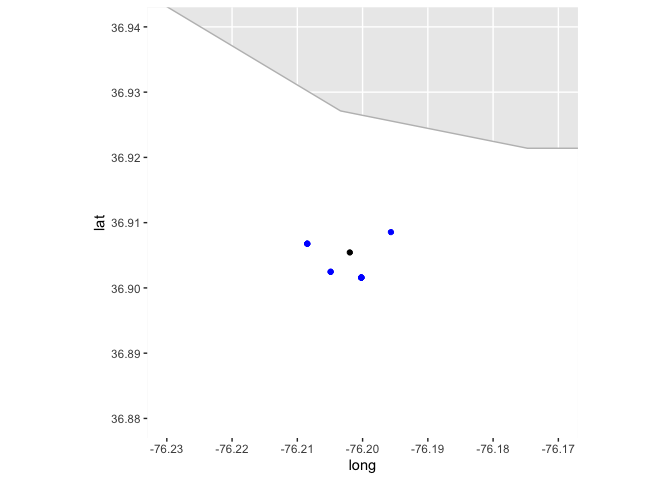
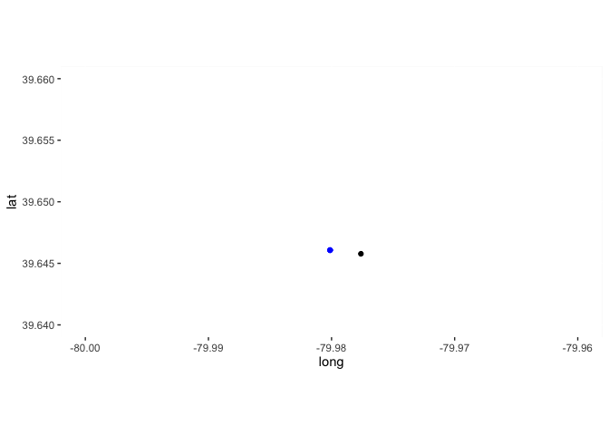
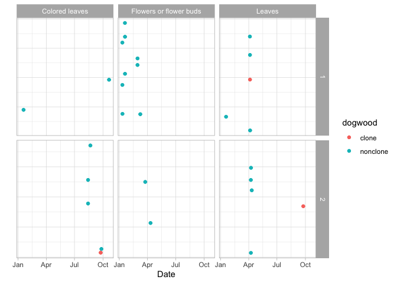

Exploratory Plotting of Dogwood Clones
================

Read in necessary libraries.

``` r
library(dplyr)
library(tidyr)
library(maps)
library(ggplot2)
library(sf)
library(cowplot)
```

Read in dogwood data extracted from NPN API and state polygons for
plotting.

``` r
base_map <- map_data("state")
dogwood_obs <- read.csv("../data/raw_all_dogwood.csv")
```

Clean up date for plotting, restricting to only Cornus florida species.

``` r
plot_obs <- dogwood_obs %>% 
  separate(observation_date, c("year", "month", "day"), remove = FALSE) %>% 
  group_by(year, individual_id) %>%
  slice(1) %>% 
  ungroup() %>% 
  filter(longitude > -130, 
         species %in% c("florida", "florida-appalachianspring")) %>% 
  mutate(Clone = ifelse(species == "florida-appalachianspring", "Yes", "No"), 
         Clone = factor(Clone, levels = c("Yes", "No")))
```

Plot locations of dogwoods and clones by year.

``` r
ggplot() +
  geom_polygon(data = base_map, aes(x = long, y = lat, group = group), 
               fill = "white", color = "grey") +
  geom_point(data = plot_obs, aes(x = longitude, y = latitude, color = Clone)) +
  scale_color_manual(values = c("red", "black")) +
  coord_quickmap() +
  facet_wrap(~year) +
  labs(x = "Longitude", y = "Latitude") +
  theme_classic() + 
  theme(legend.position = "top")
```

<!-- -->

Getting and plotting buffers around clonal points.

``` r
buffer_degrees <- 0.01

clones_locations <- plot_obs %>% 
  filter(Clone == "Yes") %>% 
  select(latitude, longitude, year, individual_id) %>% 
  st_as_sf(coords = c("longitude", "latitude")) %>% 
  rename(clone_year = year, clone_individual_id = individual_id)

clones_buffer <- st_buffer(clones_locations, dist = buffer_degrees)

nonclones_locations <- plot_obs %>% 
  filter(Clone == "No") %>% 
  select(latitude, longitude, year, individual_id) %>% 
  st_as_sf(coords = c("longitude", "latitude")) %>% 
  rename(nonclone_year = year, nonclone_individual_id = individual_id)

nonclones_in_buffer <- st_intersection(nonclones_locations, clones_buffer) %>% 
  filter(clone_year == nonclone_year) %>% 
  rename(nonclone_geometry = geometry) 
```

    ## Warning: attribute variables are assumed to be spatially constant throughout all
    ## geometries

``` r
final_clones_locations <- clones_locations %>% 
  filter(clone_individual_id %in% nonclones_in_buffer$clone_individual_id)

clones_plot <- ggplot() +
  geom_polygon(data = base_map, aes(x = long, y = lat, group = group), 
               fill = "white", color = "grey") +
  geom_sf(data = final_clones_locations, color = "blue") +
  coord_sf(xlim = c(-100, -70), ylim = c(30, 45))

nonclones_plot <- ggplot() +
  geom_polygon(data = base_map, aes(x = long, y = lat, group = group), 
               fill = "white", color = "grey") +
  geom_sf(data = nonclones_in_buffer) +
  coord_sf(xlim = c(-100, -70), ylim = c(30, 45))

plot_grid(clones_plot, nonclones_plot, ncol = 1)
```

<!-- -->

Getting just from last year the clones with at least four nearby
nonclones. Distance between each set of points is less than a kilometer.

``` r
final_clustered_dogwoods <- nonclones_in_buffer %>% 
  filter(nonclone_year == 2020) %>% 
  group_by(clone_individual_id) %>% 
  mutate(count = n()) %>% 
  filter(count >= 4)

length(unique(final_clustered_dogwoods$clone_individual_id))
```

    ## [1] 2

``` r
length(unique(final_clustered_dogwoods$nonclone_geometry))
```

    ## [1] 5

``` r
length(unique(final_clustered_dogwoods$nonclone_individual_id))
```

    ## [1] 16

``` r
ggplot() +
  geom_polygon(data = base_map, aes(x = long, y = lat, group = group), 
               fill = "white", color = "grey") +
  geom_sf(data = clones_locations[clones_locations$clone_individual_id == 229765,]) +
  geom_sf(data = final_clustered_dogwoods[final_clustered_dogwoods$clone_individual_id == 229765,], color = "blue") +
  geom_sf(data = clones_locations[clones_locations$clone_individual_id == 250718,]) +
  geom_sf(data = final_clustered_dogwoods[final_clustered_dogwoods$clone_individual_id == 250718,], color = "blue")
```

<!-- -->

``` r
ggplot() +
  geom_polygon(data = base_map, aes(x = long, y = lat, group = group), 
               fill = "white", color = "grey") +
  geom_sf(data = clones_locations[clones_locations$clone_individual_id == 229765,]) +
  geom_sf(data = final_clustered_dogwoods[final_clustered_dogwoods$clone_individual_id == 229765,], color = "blue") +
  coord_sf(xlim = c(-76.23, -76.17), ylim = c(36.88, 36.94))
```

<!-- -->

``` r
ggplot() +
  geom_polygon(data = base_map, aes(x = long, y = lat, group = group), 
               fill = "white", color = "grey") +
  geom_sf(data = clones_locations[clones_locations$clone_individual_id == 250718,]) +
  geom_sf(data = final_clustered_dogwoods[final_clustered_dogwoods$clone_individual_id == 250718,], color = "blue") +
  coord_sf(xlim = c(-80.0, -79.96), ylim = c(39.64, 39.66))
```

<!-- -->

Defining phenophases of interest:

1.  “First leaf” is first date of “Leaves” phenophase description (id
    483) for each individual
2.  “First flower” is first date of “Flowers or flower buds” phenophase
    description (id 500) for each individual
3.  “Senescence” is first date of “Colored leaves” phenophase
    description (id 498) for each
individual

<!-- end list -->

``` r
pheno_data_dic <- read.csv("../data/ancillary_phenophase_definition_data.csv")

pheno_data_dic %>% 
  filter(Phenophase_Name == "Leaves", 
         Phenophase_ID == 483) %>% 
  select(Phenophase_Definition) %>% 
  unique()
```

    ##                                                                                                                                                                                                                                                                                                            Phenophase_Definition
    ## 1                                   One or more live unfolded leaves are visible on the plant. A leaf is considered "unfolded" once the leaf stalk (petiole) or leaf base is visible. New small leaves may need to be bent backwards to see whether the leaf stalk or leaf base is visible. Do not include dried or dead leaves.
    ## 2                               One or more live, unfolded leaves are visible on the plant. A leaf is considered "unfolded" once its entire length has emerged from the breaking bud so that the leaf stalk (petiole) or leaf base is visible at its point of attachment to the stem. Do not include fully dried or dead leaves.
    ## 3 One or more live, unfolded leaves are visible on the plant. A leaf is considered "unfolded" once its entire length has emerged from a breaking bud, stem node or growing stem tip, so that the leaf stalk (petiole) or leaf base is visible at its point of attachment to the stem. Do not include fully dried or dead leaves.

``` r
pheno_data_dic %>% 
  filter(Phenophase_Name == "Flowers or flower buds", 
         Phenophase_ID == 500) %>% 
  select(Phenophase_Definition) %>% 
  unique()
```

    ##                                                                                                                                                                                                                                                                         Phenophase_Definition
    ## 1                                                                                                              One or more fresh open or unopened flowers or flower buds are visible on the plant. Include flower buds that are still developing, but do not include wilted or dried flowers.
    ## 2 One or more fresh open or unopened flowers or flower buds are visible on the plant. Include flower buds or inflorescences that are swelling or expanding, but do not include those that are tightly closed and not actively growing (dormant). Also do not include wilted or dried flowers.

``` r
pheno_data_dic %>% 
  filter(Phenophase_Name == "Colored leaves",
         Phenophase_ID == 498) %>% 
  select(Phenophase_Definition) %>% 
  unique()
```

    ##                                                                                                                                                                                                                                                                              Phenophase_Definition
    ## 1                                                                                                                                                                             One or more leaves (including any that have recently fallen from the plant) have turned to their late-season colors.
    ## 2                                                                                                         One or more leaves (including any that have recently fallen from the plant) have turned to their late-season colors. Do not include fully dried or dead leaves that remain on the plant.
    ## 3 One or more leaves show some of their typical late-season color, or yellow or brown due to drought or other stresses. Do not include small spots of color due to minor leaf damage, or dieback on branches that have broken. Do not include fully dried or dead leaves that remain on the plant.
    ## 4

``` r
phenophase_df <- dogwood_obs %>% 
  separate(observation_date, c("year", "month", "day"), remove = FALSE) %>% 
  filter(individual_id %in% final_clustered_dogwoods$clone_individual_id | individual_id %in% final_clustered_dogwoods$nonclone_individual_id, 
         year == 2020, 
         phenophase_id %in% c(483, 500, 498), 
         phenophase_status == 1) %>% 
  group_by(individual_id, phenophase_description) %>% 
  arrange() %>% 
  slice(1) %>% 
  ungroup() %>% 
  mutate(observation_date = as.Date(observation_date))

clone_1 <- final_clustered_dogwoods %>% 
  filter(clone_individual_id == 229765) %>% 
  pivot_longer(cols = c(clone_individual_id, nonclone_individual_id), names_to = "individual_id", values_to = "id") %>% 
  group_by(id) %>% 
  slice(1) %>% 
  select(individual_id, id) %>% 
  separate(individual_id, into = "dogwood", sep = "_") %>%
  mutate(cluster = 1)
```

    ## Warning in val_cols[col_id] <- unname(as.list(data[cols])): number of items to
    ## replace is not a multiple of replacement length

    ## Warning: Expected 1 pieces. Additional pieces discarded in 13 rows [1, 2, 3, 4,
    ## 5, 6, 7, 8, 9, 10, 11, 12, 13].

``` r
clone_2 <- final_clustered_dogwoods %>% 
  filter(clone_individual_id == 250718) %>% 
  pivot_longer(cols = c(clone_individual_id, nonclone_individual_id), names_to = "individual_id", values_to = "id") %>% 
  group_by(id) %>% 
  slice(1) %>% 
  select(individual_id, id) %>% 
  separate(individual_id, into = "dogwood", sep = "_") %>%
  mutate(cluster = 2)
```

    ## Warning in val_cols[col_id] <- unname(as.list(data[cols])): number of items to
    ## replace is not a multiple of replacement length

    ## Warning: Expected 1 pieces. Additional pieces discarded in 5 rows [1, 2, 3, 4,
    ## 5].

``` r
clone_lookup_table <- bind_rows(clone_1, clone_2)

phenophase_df_plot <- left_join(phenophase_df, clone_lookup_table, by = c("individual_id" = "id")) %>% 
  mutate(y_points = runif(nrow(.), min = -1, max = 1))

ggplot(phenophase_df_plot, aes(x = observation_date, y = y_points, color = dogwood)) +
  geom_point() +
  geom_jitter() +
  facet_grid(cluster ~ phenophase_description, scales = "free_y") +
  theme_light() +
  labs(x = "Date", y = "") +
  theme(axis.line.y = element_blank(), 
        axis.ticks.y = element_blank(), 
        axis.text.y = element_blank())
```

<!-- -->
